 
# **Grub Themes: Red Dead Redemption 2**

Make your Grub look like you are inside the game.

# **Previews**
|    |    |    |
|:-------:|:-------:|:---------:|
|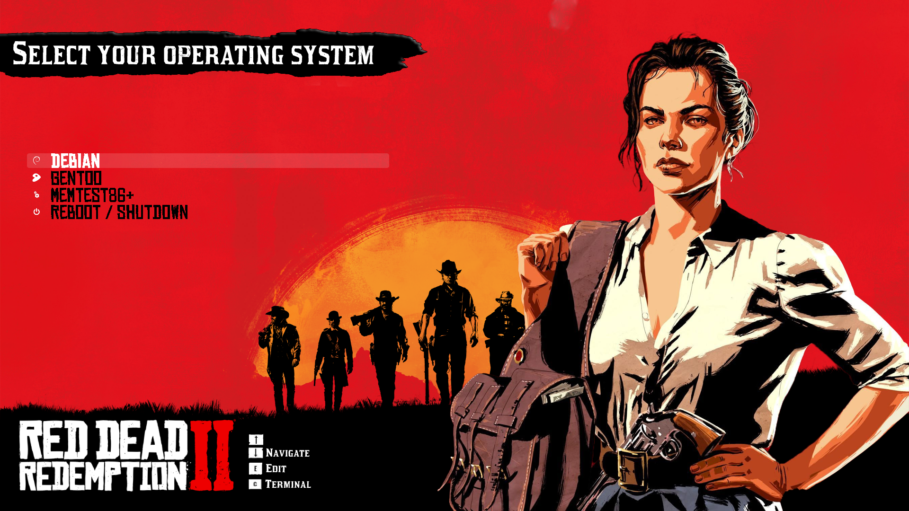|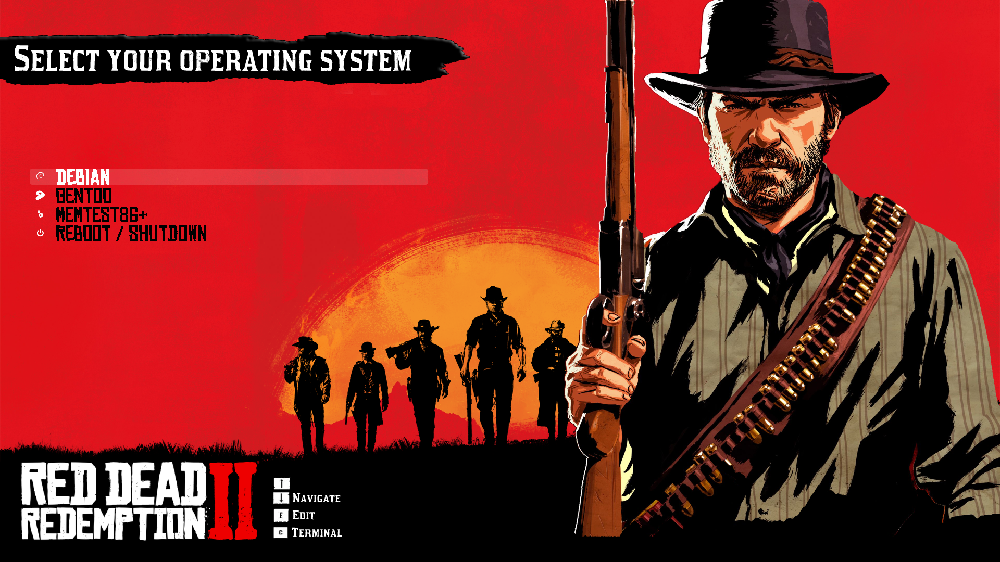|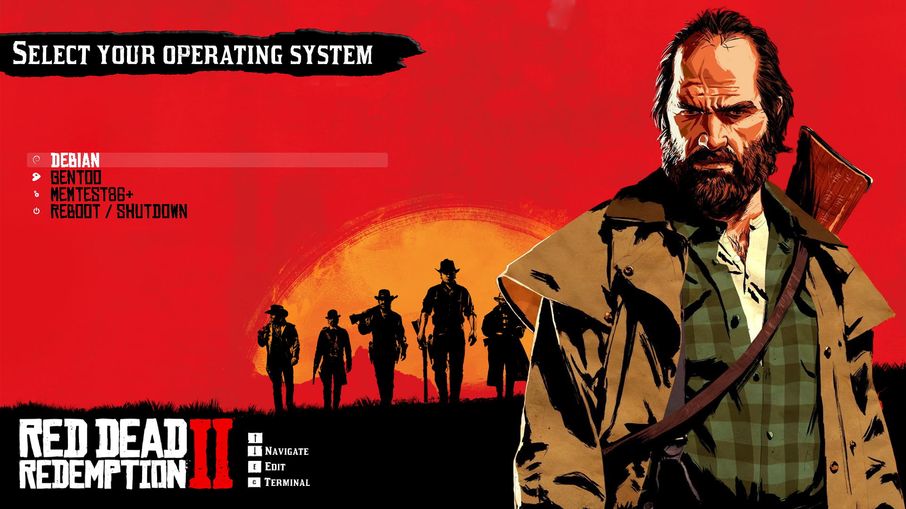|
|**Abigail Roberts**|**Arthur Morgan**|**Bill Williamson**|
|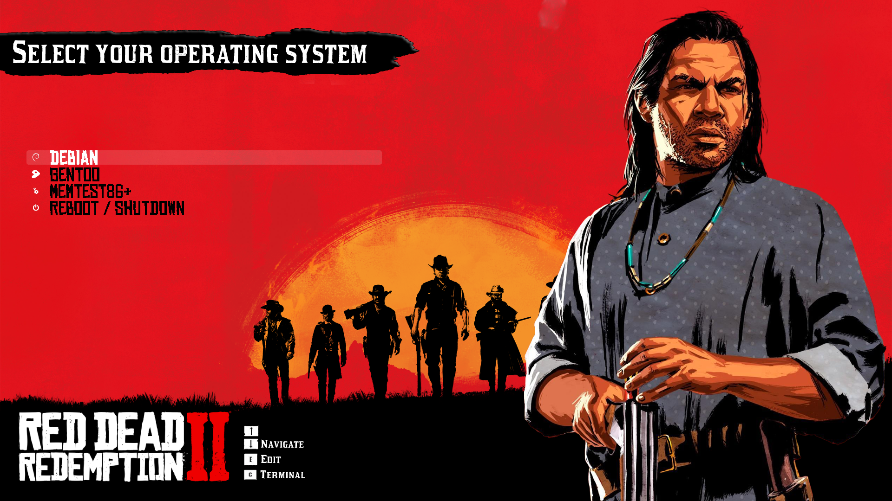|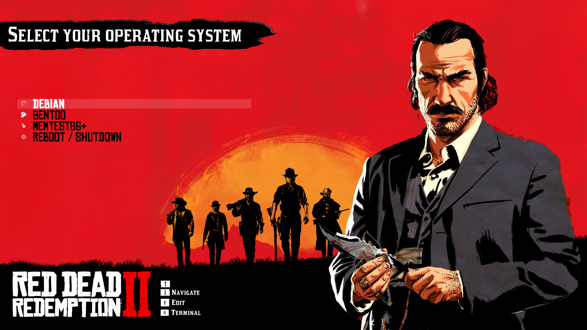|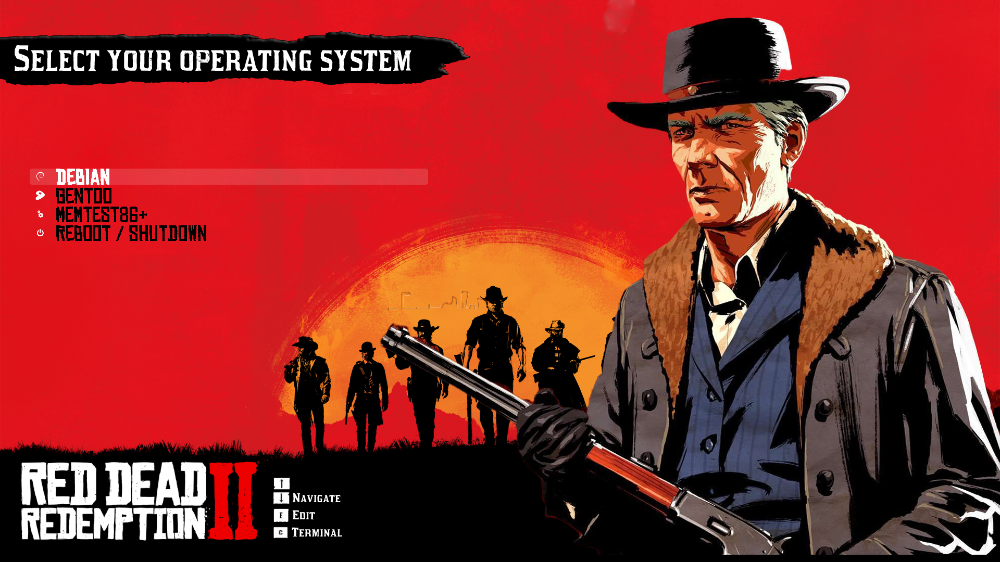|
|**Charles Smith**|**Dutch Van Der Linde**|**Hosea Matthews**|
|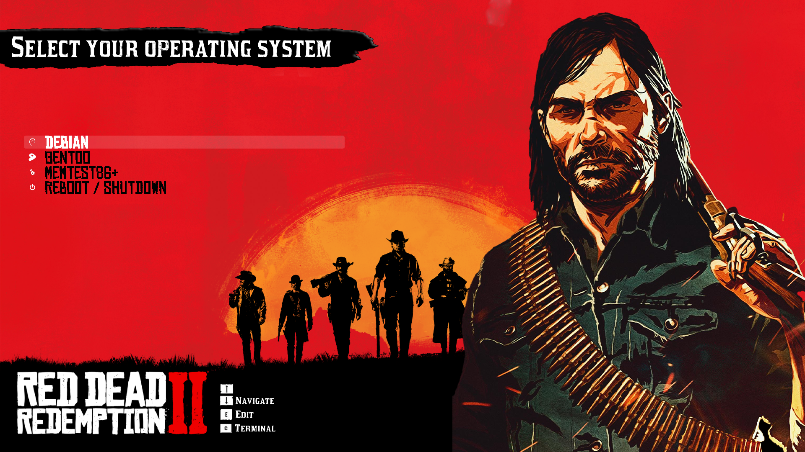|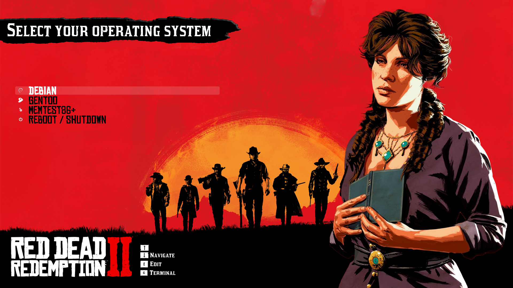|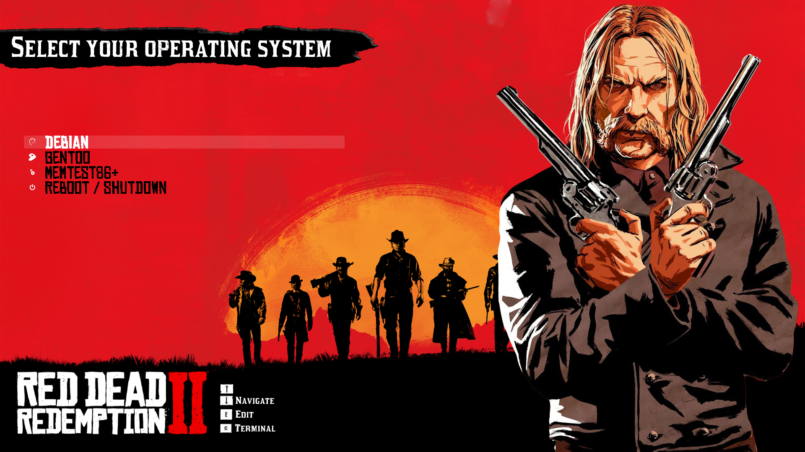|
|**John Marston**|**Lenny**|**Micah Bell**|
|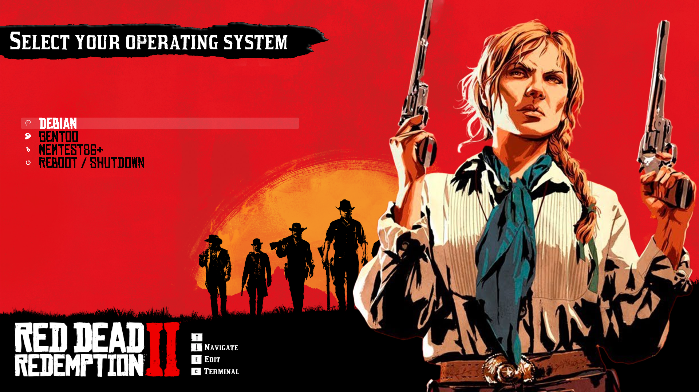|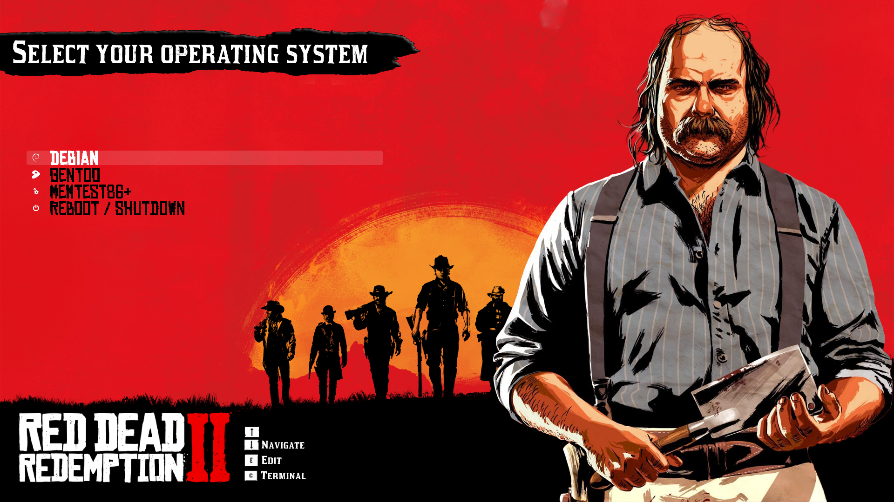|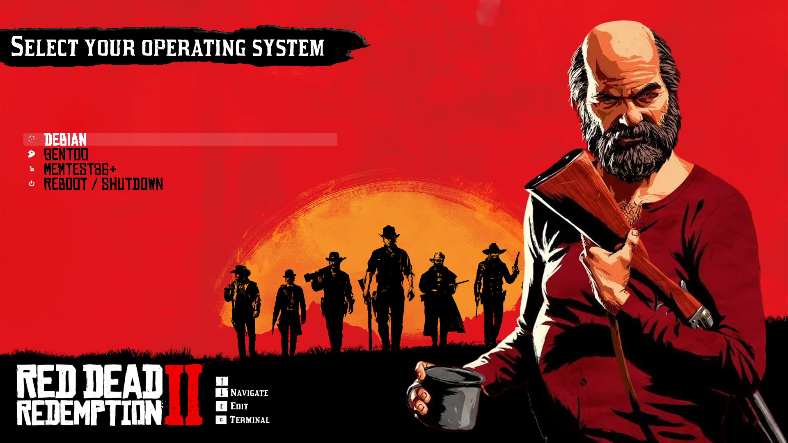|
|**Sadie Adler**|**Simon Pearson**|**Uncle**|

# **Installation**

There are many ways to install this theme. 

## **Installation via GRUB-Customizer**

Required packages:
* [git](https://github.com/git-guides/install-git) 
* [grub-customizer](https://www.javatpoint.com/grub-customizer-ubuntu)

### Installing git

#### debian/ubuntu (apt)
```
$ sudo apt-get update
$ sudo apt-get install git
```
#### Fedora/CentOS

[dnf]
```
$ sudo dnf install git
```
[yum]
```
$ sudo yum install git
```

#### arch
```
$ sudo pacman -S git

```

### Installing grub-customizer


#### debian/ubuntu (apt)
```
$ sudo add-apt-repository ppa:trebelnik-stefina/grub-customizer
$ sudo apt update
$ sudo apt install grub-customizer
```
#### Fedora/CentOS
[dnf]
```
$ sudo dnf install grub-customizer
```
[yum]
```
$ sudo yum install grub-customizer
```

#### Arch
```
$ sudo pacman -S grub-customizer
```

### Cloning the repository
```
$ git clone https://github.com/NAHDI51/rdr2-grub-theme.git
```
### Install a theme with GURB Customizer

* Open grub customizer. Type
```
$ sudo grub-customizer
```
* Click on the **Appearance settings** tab
* Enable *custom resolution* and select your resolution, e.g 3840x2160
* Press the *add theme* button, then navigate to the directory where you cloned. Afterwards, navigate to themes. In other words, navigate to
```
$DIR/rdr2-grub-theme/themes
```
* Click on the archive file you want you want. In other words, click on
```
{$CHARACTER_NAME}.tar.gz
```
* Reboot your system and enjoy.
```
systemctl reboot
```
